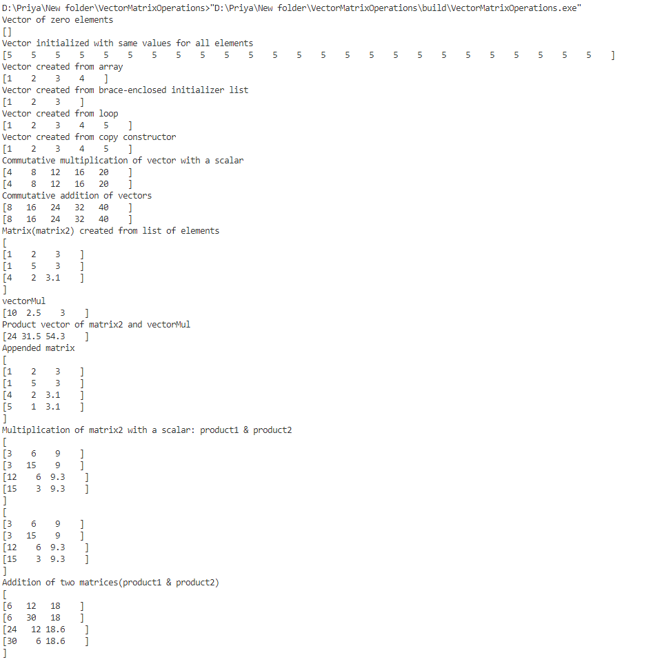

# Matrix and vector operations

## Given Assignment

To write two classes in C++ with one matrix class and vector class  

- Matrices and vectors shall be able to be multiplied   
- Addition and scalar multiplication shall be supported as well   

## Approach to perform the tasks

1. A Vector class **MyVector** is created by following the below steps

    * Private variables to hold total size, pointer to start and current capacity are created 
    * The vector objects shall be created on the heap instead of stack because of the need of dynamic allocation
    * The vector class is templated in order to have vectors of different datatypes
    * Below constructors are created 
        * Default constructor with no parameter
        * Constructor with input as length of vector and initial values
        * Constructor with input as a list of values to create **dynamic vector**
        * Constructors based on **Rule of three**
            * copy constructor
            * assignment constructor
            * destructor
    * Below public functions are created
        1. void display_elements()
            - To display elements of vector to std out
        2. unsigned int get_size()
            - To get the size of the vector
        3. unsigned int get_current_capacity()
            - To get the current capacity of vector
        4. void push(T element);
            - To push element to an existing vector
        5. void pop();
            - To pop last element of a vector
        6. T& operator;
            - To access single elements of vector with [] operator
    * Below operations are supported through public functions
        1. MyVector<T>& operator*(MyVector<T> vector, T scalar)
            - **Multiplication of vector with a scalar**
        2. MyVector<T>& MyVector<T>::operator+(MyVector<T> other)
            - **Addition of two vectors**
        3. MyVector<T>& operator*(T scalar, MyVector<T> vector)
            - **Scalar dot product of two vectors**

1. A Matrix class **MyMatrix** is created by following the below steps

    * Matrix class is a vector object that holds more vector objects that is based on the vector class created above.
    * Private variables to hold rows, columns, pointer to start and current capacity are created
    * Below constructors are created 
        * Default constructor with no parameter
        * Constructor with input as square matrix size and initial values
        * Constructor with input as a list of vectors to create **dynamic matrix**
        * Constructors based on **Rule of three**
            * copy constructor
            * assignment constructor
            * destructor
    * Below public functions are created
        1. void display_elements()
            - To display elements of matrix to std out
        2. unsigned int get_rows()
            - To get the rows of the matrix
        3. unsigned int get_columns()
            - To get the columns of the matrix
        4. void push(T element);
            - To push element to an existing matrix
        5. void pop();
            - To pop last element of a matrix
        6. T& operator;
            - To access single elements of matrix with [] operator
    * Below operations are supported through public functions
        1. MyVector& operator*(MyMatrix<MyVector> &matrix, MyVector vector);
            - **Multiplication of matrix with a vector**
        2. MyMatrix<MyVector>* operator*(MyMatrix<MyVector> &matrix, double scalar);
            - **Multiplication of matrix with scalar**
        3. MyMatrix<MyVector>* operator+( MyMatrix<MyVector> &matrix1, MyMatrix<MyVector> &matrix2);
            - **Addition of two matrices**

##Sample output

